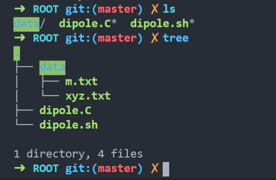
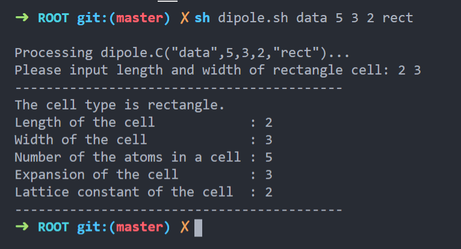
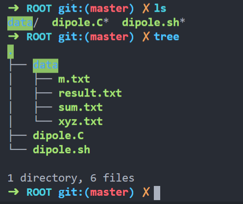
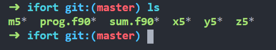
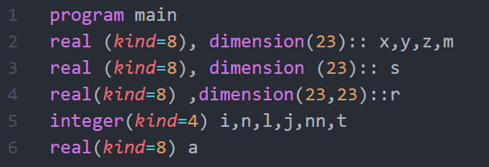
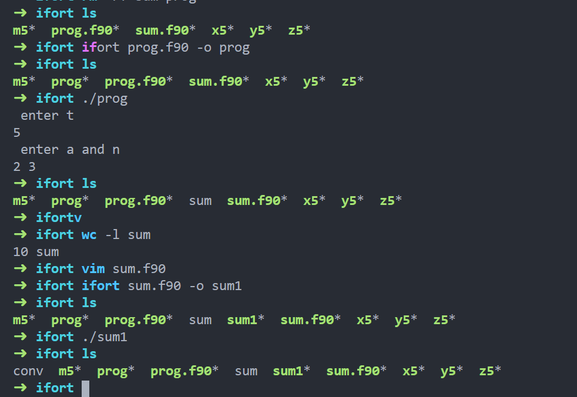

# 偶极相互作用计算

## 使用ROOT程序计算
进入 `ROOT` 文件夹中，文件如下：



- `dipole.sh` 运行脚本
- `dipole.C` 计算程序
- `xxx` 数据文件夹，包含两个文件：
    - `xyz.txt` 笛卡尔坐标系，三列数
    - `m.txt` 从 `OUTCAR` 中得到相应原子的总磁矩

运行时运行脚本（`dipole.sh`）、计算程序（`dipole.C`）与数据文件夹（`xxx`）放在同一目录下，在终端输入：
```bash
sh dipole.sh par1 par2 par3 par4 par5 
```
- `par1` 表示 数据文件（`xyz.txt` `m.txt`）存放文件夹名称 `xxx`
- `par2` 表示原胞中原子数（number of atoms in a unit cell）
- `par3` 表示扩胞倍数
- `par4` 表示晶格常数（lattice constant）
- `par5` 表示原胞类型（`rect`、`hexa`），若为 `rect`，则会提示输入长和宽



程序运行结束会在数据文件夹 `xxx` 中生成两个txt文件：
- `sum.txt` ，两两偶极相互作用结果
- `result.txt` ，两列数据，分别为级数和（积分）、级数和除以4$\pi$。




## 使用ifort编译计算
进入 `ifort` 文件夹中，文件如下：



- `prog.f90` 计算单个原胞的偶极相互作用
- `sum.f90` 对单个原胞结果积分并除以4$\pi$
- `x5` 笛卡尔坐标系x
- `y5` 笛卡尔坐标系y
- `z5` 笛卡尔坐标系z
- `m5` 原子总磁矩m

运行说明：
- 核对 `prog.f90` 开头数组长度是否与数据文件行数（原子数）一致，修改 `dimension(xx)` 括号内的值 
    
- 利用 `ifort` 编译 `prog.f90` 并运行，打开终端输入：
    ```bash
    ifort prog.f90 -o prog
    ./prog
    ```
    - `-o` 后的 `prog` 指生成可执行文件的名称，可自定义
    - 运行过程中会提示输入原胞中原子数（t），随后又会提示输入晶格常数（a）与扩胞倍数（n）
    - 运行结束会生成名为 `sum` 的文件
- 核对 sum.f90 中数组长度以及循环次数是否与`sum`文件行数一致，修改`dimension(xx)` 括号内的值与` do i=1,xx` 的值
    

    
    
    
- 利用 `ifort` 编译 `sum.f90` 并运行，打开终端输入：
    ```bash
    ifort sum.f90 -o sum1
    ./sum1
    ```
    - `-o` 后的 `sum1` 指生成可执行文件的名称，可自定义
    - 运行结束会生成名为 `conv` 的文件，两列


